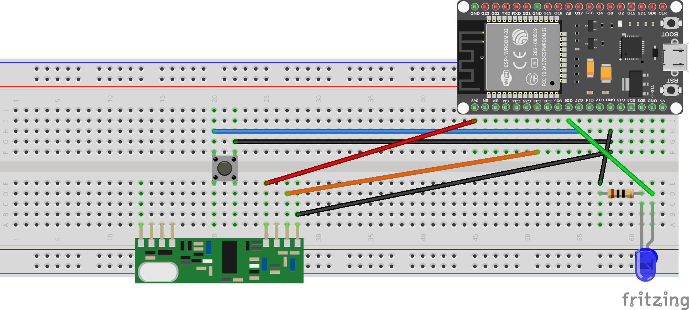
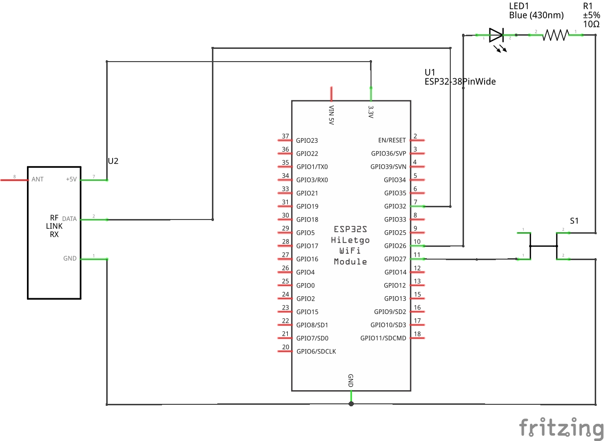

# ESP32 NC-3982-675 Receiver
Implements a receiver for signals from an NC-3982-675 weather station sensor using an ESP32 and an inexpensive 433 Mhz receiver (RX470-4) from [AliExpress](https://aliexpress.com/item/1005003436580019.html).

## Functionality
Does the following things:
1. Allows for connecting and reading from one or more NC-3982-675 sensors.
2. If at least two sensors are connected, compares the [apparent temperature](https://en.wikipedia.org/wiki/Apparent_temperature) between their readings and lights up an LED if sensor 2 reports a colder apparent temperature than sensor 1.
3. Optionally sends the received temperature and humidity values over MQTT for further use by home automation software such as Home Assistant (not yet implemented).

## Why does this exist?
I got myself some NC-3982-675 weather station sensors which work on the 433 MHz band.
Usually, these sensors are connected to a matching weather station, but they can also be read using a generic radio receiver matching the used frequency.
I was planning on using two sensors, one outside and one inside to determine when to open the windows to cool down my apartment during summer nights.

For connecting many different supported sensors, [`rtl_433`](https://github.com/merbanan/rtl_433) exists.
`rtl_433` needs some more versatile radio hardware than I had laying around (mine only has a single data out line and also doesn't support advanced functionality such as switching frequencies).
Also, using a Raspberry Pi feels overpowered for what I am trying to accomplish.

A [port of `rtl_433` to the ESP32](https://github.com/NorthernMan54/rtl_433_ESP) also exists.
This one seemed more suitable for what I had in mind for the hardware, but still assumes you want to connect several different models of weather sensors and that you use an advanced radio receiver with more complex functionality.

As the protocols behind these sensors have already been studied and other repos implementing reading these sensors exist (see [credit](#credit-where-credit-is-due)), I decided to replicate that functionality for my use-case.

## Requirements
For the hardware, you need:
1. An ESP32 development board. I use an ESP32-WROOM-32 board by AZDelivery, but pretty much any other ESP32 should be fine.
2. An RX470-4/WL101-341 433 Mhz RF receiver. Can be bought as a sender-receiver pair for cheap from AliExpress. Don't forget to solder the antenna to the ANT pads. Other receivers with one data out line should work the same way, but I did not test them. If you spend a few more bucks and get a receiver such as the CC1101, then you can probably just use [`rtl_433_ESP`](https://github.com/NorthernMan54/rtl_433_ESP) instead of this project.
3. A 4-pin pushbutton
4. An LED with a matching resistor

## Building
This is a standard PlatformIO project. Use VSCode and the PlatformIO plugin to build and upload the code to the ESP32.

## Wiring
### Connect the RX470-4 receiver:
| RX-470-4 | ESP32 |
| --- | --- |
| GND | GND |
| VIN | 3.3V |
| Data (either pin of the two) | GPIO32 |

Note: some sources online mentioned that the RX470-4 board only works with 5V.
I have not had any problems running it at 3.3V, the product description page on AliExpress also mentions that it should be able to run at that voltage.

### Connect the reset button
Connect one pin to GND, the pin next to it to GPIO27.

### (Optional) Connect the LED for indicating when outside temperature feels lower than inside temperature
Connect an LED and a matching resistor in series between GPIO26 and GND, with the short leg (cathode) facing GND.

### Breadboard view and schematic
The breadboard view uses a different part as there is no equivalent part in Fritzing. Use the wiring as described above.

## Functionality
On first start, the system will find no previously connected sensors.
To register a sensor with the ESP32, press the "TX" button on the back inside the sensor casing.
You can register up to `NUM_SENSORS` sensors this way.
If you have more than 1 sensor defined (`NUM_SENSORS` >= 2), the first sensor is assumed to be the inside sensor and the second one to be the outside sensor.

The sensors are identified by their ID which changes whenever the battery of a sensor is changed.
The channel you can choose through a slider inside the casing is not the ID and is ignored (this means you can connect more than 3 sensors).

You can clear all known sensors by holding the reset button for more than 1 second.
If a sensor runs out of battery, it will get a new ID when you change them, so you will need to register all sensors again whenever you do.

For more information through debug messages, you can connect to the board using the serial monitor.

Whenever the apparent temperature for sensor 2 is colder than the one for sensor 1, the LED lights up.

## How decoding the RF signal works
This section might be partly or completely wrong and is based on how I understand everything I found on the internet about this sensor.

The RF receiver board emits either a high or low signal whenever radio signals are received.
The received signals are binary, there is no information carried by the amplitude.
Using interrupts, the program keeps track of whether the signal changed from low to high (start of pulse, end of gap) or from high to low (start of gap, end of pulse).
For every *gap*, its duration is tracked, pulses carry no information and are ignored.
Based on the duration of each gap, zeros and ones are encoded.
More info about this can be found at [the source file for the decoder at the rtl_433 repository](https://github.com/merbanan/rtl_433/blob/master/src/devices/infactory.c).

The payload of each transmission is detected based on a fixed length prefix and postfix gap.
Each payload bit is encoded in-between those two markers.
The bits are then checked for completeness and interpreted into temperature and humidity values.
Note: the code responsible for interpreting the data does not do any error checking. If data is corrupted during transmit, you may receive incorrect values.

## Credit where credit is due
The actual hard work of decoding the protocol of these sensors was done by the folks over at [https://github.com/merbanan/rtl_433](https://github.com/merbanan/rtl_433) and [http://gitlab.com/hp-uno, e.g. uno_log_433](https://gitlab.com/hp-uno/uno_log_433), I did not do any reverse engineering myself.

Thanks to Hagen Patzke over at [https://gitlab.com/hp-uno/uno_log_433](https://gitlab.com/hp-uno/uno_log_433), who implemented a decoder for the signals using a WL101-341 which seems to be pretty much the same receiver.

